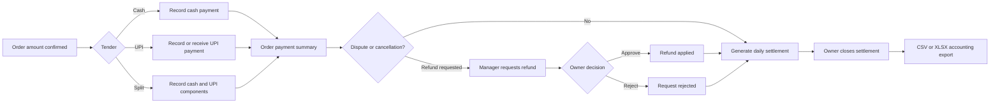

# Order-to-Cash Operations

This guide defines the operational and governance workflow for converting fulfilled orders into reconciled merchant receipts.

## Control flow



## Recording a payment

```json
{
  "order_id": 42,
  "amount": 500,
  "method": "split",
  "cash_amount": 200,
  "upi_amount": 300,
  "provider_ref": "upi-bank-reference-123",
  "notes": "Customer paid at delivery"
}
```

KiranaOS computes the current outstanding amount before accepting the mutation. It rejects overpayment and invalid split compositions.

## Refund workflow

Refunds use a two-step authority boundary:

1. A manager creates a refund request with an amount and reason.
2. An owner approves or rejects the request.

Approval updates both the refund record and the payment's refundable state. Partial refunds remain distinguishable from full refunds.

## Daily settlement

Settlement generation recomputes:

- cash received;
- UPI received;
- approved refunds;
- net receipts; and
- payment count.

A manager may generate and review the draft. An owner closes it. Closure records the responsible operator and timestamp and prevents subsequent recalculation from silently rewriting the closed evidence.

## Accountant handoff

`GET /api/accounting/export` supports:

- `format=csv` for broad POS and bookkeeping compatibility;
- `format=xlsx` for direct spreadsheet review; and
- optional `day=YYYY-MM-DD` scoping.

Each row includes date, record type, reference, order, customer, tender method, gross amount, refund amount, net amount, status, and notes.
